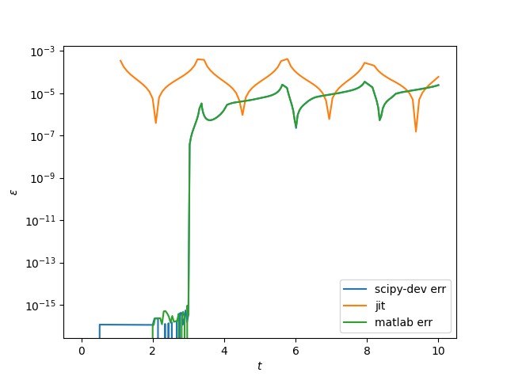
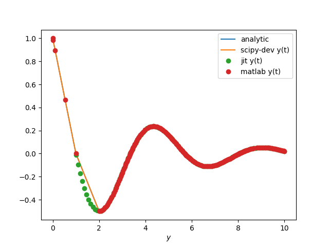
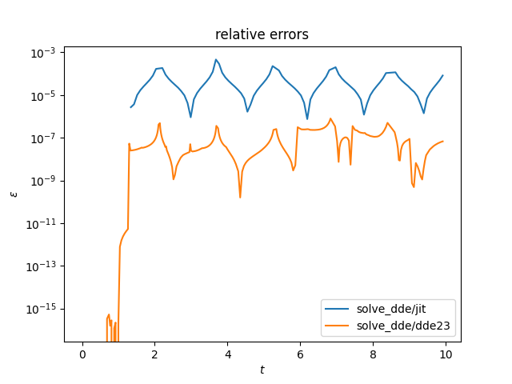
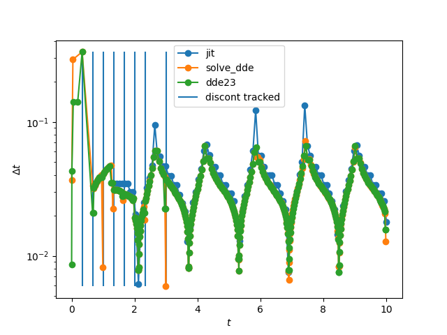
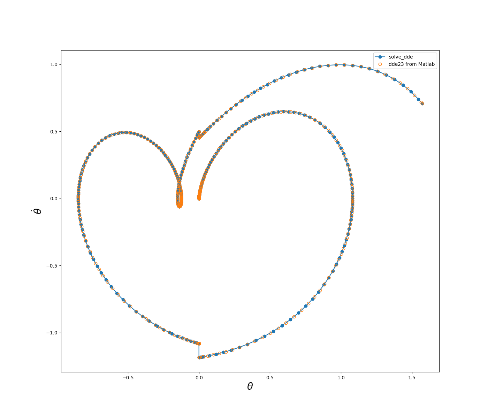

DDE Solver : ***solve_dde***
=====


A development of delay differential equations solver in SciPy from a fork of version '1.5.0.dev0+912c54c'.

The solver is derived from solve_ivp function from scipy/integrate._ivp. 
You will find the folder scipy/integrate/_dde where all the changes have been made. 
The function in named ***solve_dde*** in *scipy/integrate/_dde/dde.py*

It use the method of step with embedded Runge-Kutta RK23 or RK45 at this time.
Evaluation of delay terms is realized with continuous extension  of RK integration.

## Requirement 
All requirement for this development are listed in
```console
pip freeze > requirements.txt
```


## Sources
https://www.radford.edu/~thompson/webddes/index.html\

https://www.radford.edu/~thompson/webddes/ddeevtwhite.html

## Benchmarks

### converging problem

y'(t) = y(t-1) \
y(t0)=y_0 \
y(t<t0) = y_0 \

```py
import scipy
from scipy.integrate._dde.dde import solve_dde
import numpy as np

def fun(t,y,Z):
    y_tau = Z[:,0]
    return [ - y_tau ]

tau = 1
y0 = [1.]
t0 = 0.0
tf = 6.0
atol = 1e-10
rtol = 1e-5
tspan = [t0, tf]
delays = [tau]
def h(t):
    return [1]
sol = solve_dde(fun, tspan, delays, y0, h, method='RK23', atol=atol, rtol=rtol)
t = sol.t
y = sol.y[0,:]
yp = sol.yp[0,:]
plt.figure(figsize=(18,14))
plt.plot(t, y, label='scipy-dev y(t)')
plt.legend()
```





### diverging problem
same as converging problem but with +

y'(t) = y(t-1) \
y(t0)=y_0 \
y(t<t0) = y_0 \


### 2 delays 

y'(t) = -y(t-1/3) - y(t-3/2)\
y(t0)=y_0 \
y(t<t0) = y_0 \





### rocking suitcase model

```py
t0 = 0.0
tf = 12
tspan = [t0, tf]
tau = .1
gamma = 0.248
beta  = 1
A = 0.75
omega = 1.37
eta = np.arcsin(gamma/A);
y0 = [0.0, 0.0]
atol = 1e-10
rtol = 1e-5
delays = [tau]
def fun(t,y,Z):
    y_tau = Z[:,0]
    return [y[1],
            np.sin(y[0]) - np.sign(y[0]) * gamma * np.cos(y[0]) - beta * y_tau[0]
            + A * np.sin(omega * t + eta)]
def finalEvent(t,y,Z):
    return np.abs(y[0])-np.pi*.5
finalEvent.direction = 0 # % All events have to be reported
finalEvent.terminal = True
def hitGround(t,y,Z):
    return y[0]
hitGround.direction = 0 # % All events have to be reported
hitGround.terminal = True
events = [finalEvent, hitGround]
sol23 = solve_dde(fun, tspan, delays, y0, y0, method='RK23',atol=atol, rtol=rtol ,events=events)
print("\nKind of Event:               scipy-dev         dde23       reference ")
ref = [4.516757065, 9.751053145, 11.670393497];
mat = [4.5167708185, 9.7511043904, 11.6703836720]
e = 0
while(sol23.t[-1]<tf):
    if not (sol23.t_events[0]): # if there is not finalEvent
        print('A wheel hit the ground. ',sol23.t[-1],'',mat[e],'',ref[e])
        y0 = [0.0, sol23.y[1,-1]*0.913]
        tspan = [sol23.t[-1],tf]
        sol23 = solve_dde(fun, tspan, delays, y0, sol23, method='RK23',
                  atol=atol, rtol=rtol ,events=events)
        e += 1
    else:
        print("The suitcase fell over. ",sol23.t[-1],'',mat[e],'',ref[e])
        break
t = sol23.t
y = sol23.y[0,:]
yp = sol23.y[1,:]
```


```py
plt.figure(figsize=(18,14))
plt.plot(t, y,'o', label='scipy-dev y(0)(t)')
plt.legend()
plt.figure(figsize=(18,14))
plt.plot(y, yp, label='phase diagram')
plt.legend()

```

Kind of Event:               scipy-dev         dde23       reference

A wheel hit the ground.  4.516774682927172  4.5167708185  4.516757065\
A wheel hit the ground.  9.751129253909937  9.7511043904  9.751053145\
The suitcase fell over.  11.670391711563916  11.670383672  11.670393497\




### Kermack-McKendrick an infectious disease model

```py
from scipy.integrate import solve_dde
import matplotlib.pyplot as plt      
import numpy as np                   

def fun(t,y,Z):
    y_tau1 = Z[:,0]
    y_tau10 = Z[:,1]
    return [-y[0] * y_tau1[1]  + y_tau10[1],
            y[0] * y_tau1[1] -  y[1],
            y[1] - y_tau10[1]]

def zero_y0(t,y,Z):
    y_tau1 = Z[:,0]
    y_tau10 = Z[:,1]
    return -y[0] * y_tau1[1]  + y_tau10[1]
zero_y0.direction = -1
zero_y0.terminal = False

def zero_y1(t,y,Z):
    y_tau1 = Z[:,0]
    return y[0] * y_tau1[1] -  y[1]
zero_y1.direction = -1
zero_y1.terminal = False

def zero_y2(t,y,Z):
    y_tau10 = Z[:,1]
    return y[1] - y_tau10[1]
zero_y2.direction = -1
zero_y2.terminal = False
t0 = 0.0
tf = 40
tau1 = 1.
tau10 = 10.
gamma = 0.248;
beta  = 1;
A = 0.75;
omega = 1.37;
eta = np.arcsin(gamma/A);
y0 = np.array([5.,.1,1.0])
delays = [tau1,tau10]
tspan = [t0, tf]
zeros = [zero_y0,zero_y1,zero_y2]
atol = 1e-10
rtol = 1e-5
sol23 = solve_dde(fun, tspan, delays, y0, y0, method='RK23', events=zeros, atol=atol, rtol=rtol)


```
     t_event y0 :
         solver_dde method='RK23' = [15.68805593 31.01201453]
         Matlab dde23 =             [15.68805593 31.01201453]
         relative error =           [8.95347197e-06 1.62520340e-05] 
     t_event y1 :
         solver_dde method='RK23' = [ 3.59025533 18.49136555 34.1969848 ]
         Matlab dde23 =             [ 3.59025533 18.49136555 34.1969848 ]
         relative error =           [7.87418187e-06 1.41287527e-05 2.22760967e-05] 
     t_event y2 :
         solver_dde method='RK23' = [ 8.22797114 23.48149022 39.26973689]
         Matlab dde23 =             [ 8.22797114 23.48149022 39.26973689]
         relative error =           [1.57069176e-05 5.47151701e-06 1.53232619e-05] 


### Mackey Glass

```py

```


